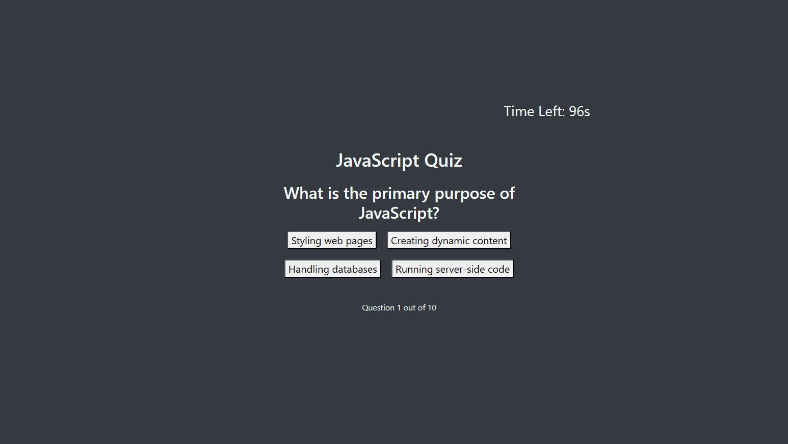

# Quiz Website

Welcome to the Quiz Website! This website allows users to participate in a JavaScript quiz with a timer, scoring system, and past score tracking.

## Table of Contents

- [Features](#features)
- [Getting Started](#getting-started)
- [How to Play](#how-to-play)
- [Scoring](#scoring)
- [Past Scores](#past-scores)
- [Retaking the Quiz](#retaking-the-quiz)
- [Customization](#customization)
- [Contributing](#contributing)
- [License](#license)

## Features

- JavaScript quiz with multiple-choice questions
- Timer to add time pressure
- Scoring system based on correct answers
- Tracking of past scores with initials and completion time
- Ability to retake the quiz

## Getting Started

To get started with the quiz, simply click the "Start Quiz" button on the website.

## How to Play

1. Click the "Start Quiz" button to begin.
2. Answer each question by clicking on the provided options.
3. For each correct answer, you earn 10 points.
4. For each incorrect answer, you lose 10 seconds from the timer.
5. Complete the quiz before the timer runs out.

## Scoring

- Correct Answer: +10 points
- Incorrect Answer: -10 seconds

Your final score is based on the number of correct answers and the time remaining.

## Past Scores

The website keeps track of past scores. You can view the past scores on the page. Each entry shows the player's initials, score, and completion time.

## Retaking the Quiz

After completing the quiz, you can retake it by clicking the "Retake Quiz" button. This resets the timer, question index, and score.

## Screenshot

## Customization

Feel free to customize the quiz by adding more questions or adjusting the timer duration. Check the JavaScript and CSS files for easy modifications.

## Contributing

Contributions are welcome! If you have ideas for improvements or new features, please open an issue or submit a pull request.

## License

N/A